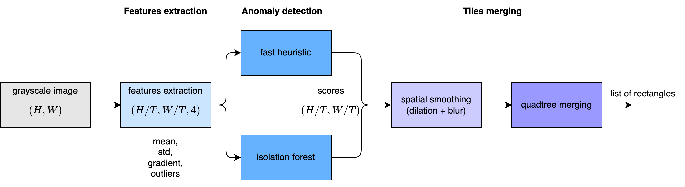
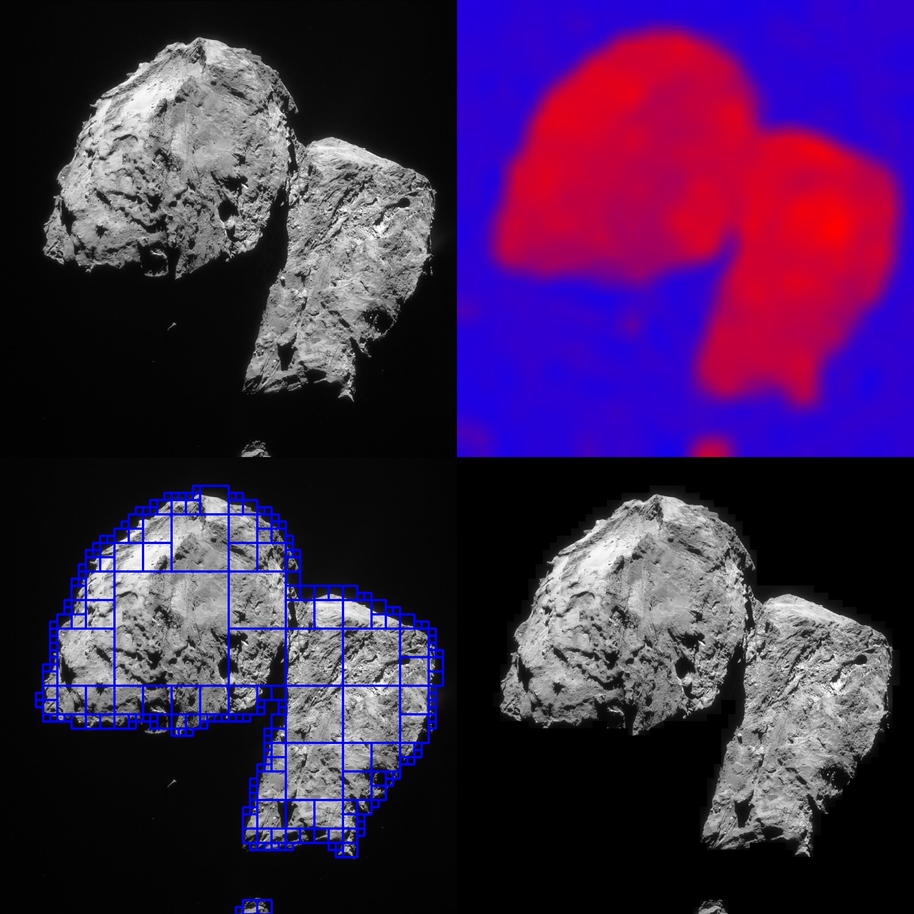
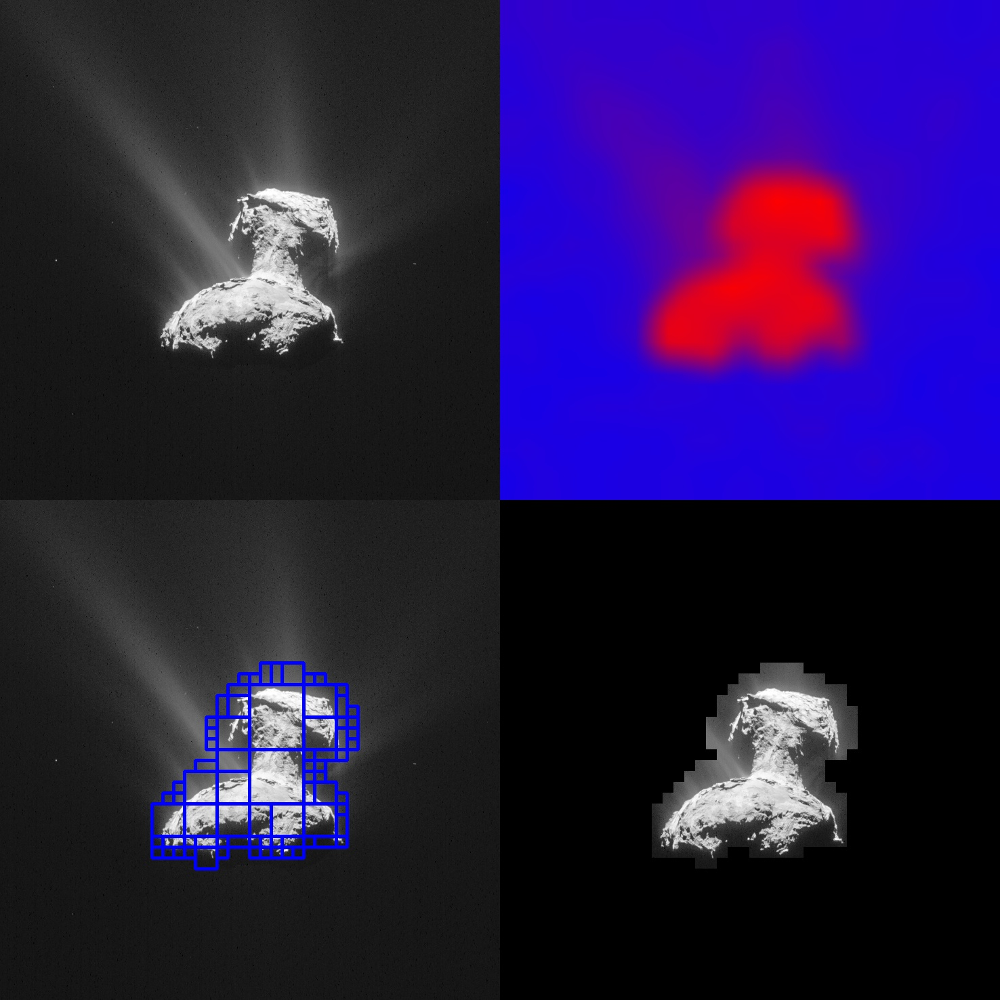
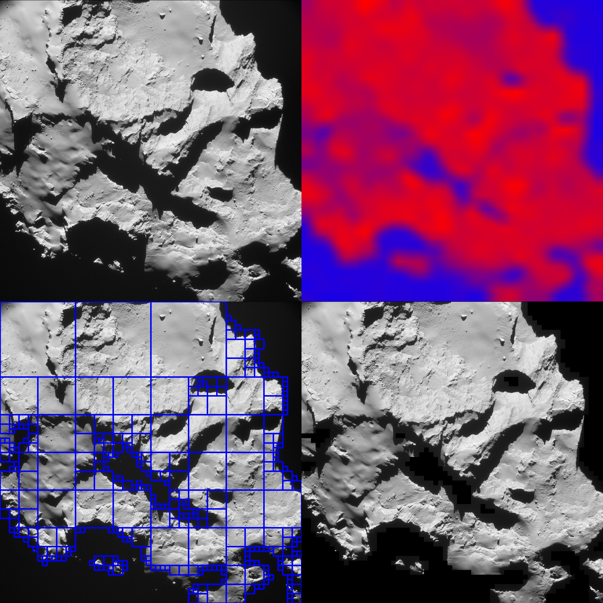

## Executive Summary

This software pipeline provides real-time, onboard processing of scientific deep-space imagery for ESA's Hera mission sandbox (Core 1). By shifting from full-frame transmission to intelligent tile selection, the system isolates high-interest geological features (craters, boulders, ejecta fields) and prunes featureless space or flat regolith. The result is a prioritized, bandwidth-efficient payload format ready for deep-space downlink.

  

## System Architecture & Pipeline Workflow

```
               [ Input Image (2D Grayscale) ]
                             │
                             ▼
            [ 4D Tensor Reshaping & Slicing ]
                             │
                             ▼
         [ Vectorized Feature Extraction (Per Tile) ]
          • Mean  • Std Dev  • Gradient  • Outliers
                             │
                             ▼
               [ Tile Scoring Mechanism ]
         ┌───────────────────┴───────────────────┐
         ▼                                       ▼
  Option A: Fast Heuristic                Option B: Unsupervised ML
   (Feature Averages)                      (Isolation Forest)
         └───────────────────┬───────────────────┘
                             │
                             ▼
          [ Spatial Smoothing (Dilation + Blur) ]
                             │
                             ▼
      [ Quadtree Merging & Bandwidth-Aware Pruning ]
                             │
                             ▼
           [ Priority-Sorted Output Rectangles ]
```

### System Architecture Diagram




## Core Working Principles

### 1. Vectorized Tensor Tile Extraction

To ensure execution within strict flight-processor constraints (LEON3 architecture), the image is cropped to exact multiples of `TILE_SIZE` (default: $16 \times 16$ pixels) and reshaped into a 4D tensor: `(grid_h, grid_w, tile_h, tile_w)`. This enables zero-loop batch vectorization across all tiles simultaneously.

  

Python

```
# Reshape to 4D tensor for fast vectorized operations
cropped = image[:grid_h * tile_size, :grid_w * tile_size]
tiles = cropped.reshape(grid_h, tile_size, grid_w, tile_size).swapaxes(1, 2)
```

### 2. Multi-Dimensional Feature Extraction

Each tile is condensed into a compact vector of statistical surrogates capturing local surface structure:

  

- **Mean Intensity ($\mu$):** Base brightness level.
- **Standard Deviation ($\sigma$):** Surface roughness and texture variation.
- **Gradient Magnitude ($G_x + G_y$):** Edge and contour density (Sobel surrogate).
- **Outlier Pixel Fraction:** Proportion of pixels exceeding $1.5\sigma$ from the tile mean (captures 

### 3. Anomaly & Interest Scoring

The pipeline evaluates tile interest using one of two selectable modes:

1. **Statistical Heuristic Mode (`score_tiles`):**

    Averages normalized feature matrices, scales scores to $[0.0, 1.0]$, and applies spatial filtering.

2. **Unsupervised Machine Learning Mode (`score_tiles_iforest`):**

    Filters out dead-space tiles ($\sigma < 10^{-5}$) to prevent empty space from being flagged as anomalous. Trains a lightweight `IsolationForest` on valid surface tiles to identify rare, unexpected textures.


### 4. Spatial Smoothing for Quadtree Stability

Isolated high-score tiles cause over-segmentation. To prevent fragmented quadtree splitting, scores pass through morphological **dilation** and **spatial blurring**. This expands peak interest scores into surrounding regions, forming unified interest zones.

  

Python

```
# Morphological expansion prevents tile-to-tile score jumping
scores = cv2.dilate(scores, numpy.ones((blur_kernel, blur_kernel), numpy.float32))
scores = cv2.blur(scores, (blur_kernel, blur_kernel))
```

### 5. Bandwidth-Aware Quadtree Merging (`merge_tiles_q`)

The smoothed score map is evaluated recursively using a Quadtree structure:

  

- **Pruning:** Sub-regions where $\text{Max Score} < \text{Threshold}$ are dropped completely ($0$ bytes queued for downlink).

- **Leaf Decision:** Sub-regions with score variance $\le \text{max\_score\_std}$ and size $\le \text{max\_block\_tiles}$ are merged into a single contiguous rectangle.

- **Splitting:** Non-uniform regions are split into sub-quadrants to drop low-scoring background areas while preserving high-resolution coverage over anomalies.

## Algorithmic Options & Comparisons

|**Component**|**Option A**|**Option B**|**Selection Criteria**|
|---|---|---|---|
|**Feature Set**|Standard (`extract_tile_features`)|Advanced (`extract_tile_features_advanced`)|Use Advanced when fine, high-contrast surface glints or isolated boulders must be detected.|
|**Scoring**|Direct Heuristic (`score_tiles`)|Isolation Forest (`score_tiles_iforest`)|Use Heuristic for deterministic low-power execution; use Isolation Forest for true unsupervised novelty discovery.|
|**Tile Merging**|Quadtree (`merge_tiles_q`)|Max-Rectangle Histogram (`merge_tiles`)|Use Quadtree for multi-scale block downlinking; use Max-Rectangle for uniform sub-window extraction.|

## Configuration Parameters

Python

```
TILE_SIZE           = 16    # Atomic processing tile dimension in pixels (16x16)
MIN_SCORE_THRESHOLD = 0.5   # Minimum score required for downlink qualification
MAX_SCORE_STD       = 0.15  # Max allowed score deviation before quadtree splits
MAX_BLOCK_TILES     = 16    # Maximum merged block size (16 tiles = 256x256 pixels)
BLUR_KERNEL         = 3     # Spatial smoothing kernel size for score aggregation
```

## Pipeline Execution Output

The visual debugger generates a $2 \times 2$ composite diagnostic output showing pipeline decisions in real-time:

  

1. **Top-Left:** Original raw camera input frame.
2. **Top-Right:** Heatmap of tile interest scores ($0.0 = \text{Blue/Background}$, $1.0 = \text{Red/High Interest}$).
3. **Bottom-Left:** Target bounding boxes overlaid on the raw frame after Quadtree merging.
4. **Bottom-Right:** Downlink target mask displaying only prioritized image blocks.






## Flight Computer (LEON3) Feasibility

- **Memory Protection:** Zero dynamic allocation inside execution loops. Array sizes are pre-calculated based on tile grid dimensions.
- **CPU Footprint:** Relying on vectorized NumPy operations avoids Python loops, keeping execution deterministic and within allocated daily computing windows ($2\text{--}3 \text{ hours/day}$).
- **Abrupt Shutdown Safety:** The algorithm operates statelessly on a frame-by-frame basis, making it fully tolerant to unexpected Safe Mode interrupts on Core 0.