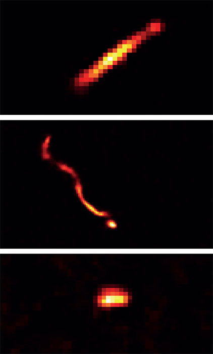
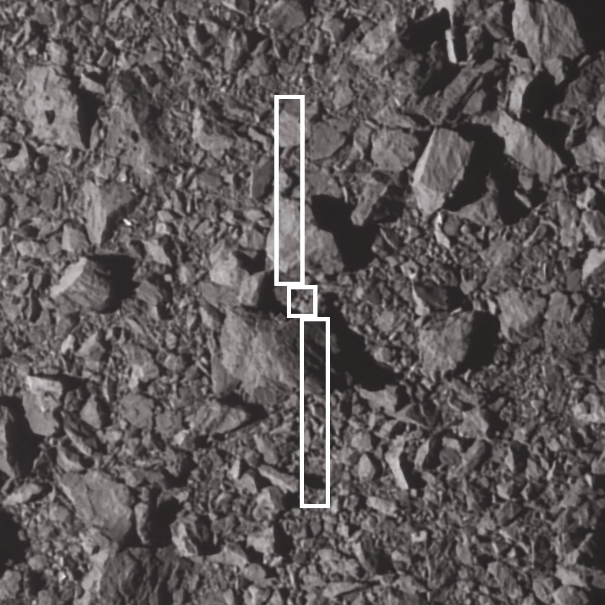

## 1. Autonomous Star Navigation (Lost-In-Space & Edge Cases)

The Concept: Enhancing standard optical navigation by running a highly robust, artifact-resistant "Lost-in-Space" (LiS) algorithm on the edge, capable of self-initializing without prior state knowledge.

### Current State

Star trackers are the backbone of spacecraft attitude determination. They rely on pattern-matching algorithms (like Pyramid or Grid algorithms) to identify star fields based on the angular distances between stars. These systems work exceptionally well under nominal conditions and are widely used across all deep-space missions.

### Current Problems (The Space Agency Struggle)

While mature, star trackers fail in critical edge cases, often forcing the spacecraft into Safe Mode:

- Stray Light & Lens Flares: Unexpected illumination from the Sun, Earth albedo, or spacecraft self-reflection can wash out star fields or create false positives.
    
- Radiation Interference (Cosmic Rays): High-energy particles striking the CMOS sensor create transient hot pixels and streaks that algorithms misidentify as stars.
    
- High Slew Rates (Smearing): During proximity maneuvers (like those around Dimorphos), rapid rotation blurs stars, breaking standard centroiding algorithms.
    
- Compute Limitations: "Lost-in-space" recovery algorithms usually require full database searches. On a resource-constrained LEON processor (typically 50–100 MHz), this is incredibly slow and computationally taxing.
    

### Where We Shine (The Innovation)

Our experiment will demonstrate a resilient, integer-optimized Lost-in-Space algorithm that filters out non-stellar artifacts (lens flares, cosmic rays) before centroiding. By running this purely in the Core 1 sandbox, we prove that a spacecraft can autonomously recover its attitude from a cold start, even in a high-radiation or high-stray-light environment, without interrupting the mission-critical Core 0 flight software.

Relevant Datasets for Testing:

- ESA Planetary Science Archive: The [Cosmic Ray detections on Gaia CCDs](https://www.cosmos.esa.int/web/gaia/cosmic-ray-detections-on-gaia-ccds) dataset provides raw FITS engineering data showing exactly how radiation artifacts appear on a space-grade sensor.
    

## 2. Onboard Camera as a Charged Particle Detector

The Concept: Repurposing Hera's existing navigation/imaging cameras as secondary science instruments to map the deep-space radiation environment, entirely through edge computing.

### Current State

The principle of using CMOS image sensors as silicon track detectors is proven. On Earth, citizen science projects like [DECO (Distributed Electronic Cosmic-ray Observatory)](https://pos.sissa.it/501/1257/) use smartphone cameras to detect muons and ionizing radiation. In space, these same particle tracks are routinely observed as "noise" in the raw dark frames of missions like SOHO, Rosetta (OSIRIS), and Hubble.

### Current Problems (The Space Agency Struggle)

Currently, cosmic ray hits are treated as a nuisance. To study them scientifically, agencies must downlink massive, uncompressed "dark frame" images to Earth for post-mission analysis. In deep space, where downlink bandwidth is severely limited, sending full images of dark space is a massive waste of telemetry resources.

### Where We Shine (The Innovation)

Instead of downlinking images, our software will perform Edge Computing on Core 1.

- The Mechanism: Using either Dark Frame Subtraction (if a lens cap is used) or Temporal Median Filtering (comparing consecutive frames while pointing at stars), the software will isolate transient radiation hits.
    
- The Added Value: We will extract morphological features (track length, thickness, intensity) to estimate particle energy and type. We will then downlink only the computed telemetry—a tiny, highly compressed text manifest of particle counts and classifications. This turns a navigation camera into a zero-cost space weather instrument, perfectly aligning with ESA's goal of "Data Prioritisation."
    

## 4. Feature Tracking & Descriptor Selection for Asteroid Proximity

The Concept: Developing an ultra-lightweight, illumination-invariant feature descriptor tailored specifically for tracking landmarks on rocky asteroids during proximity operations.

### Current State

Feature detection and matching is critical for advanced Guidance, Navigation, and Control (GNC). Algorithms identify salient points in an image and generate a descriptor to track that point across frames.

|             |                |                                        |                                                                        |
| ----------- | -------------- | -------------------------------------- | ---------------------------------------------------------------------- |
| Algorithm   | Type           | Strengths                              | Weaknesses for Space Edge-Computing                                    |
| SIFT / SURF | Floating-point | Excellent scale & rotation invariance  | Too computationally heavy for LEON processors; relies on complex math. |
| ORB         | Binary         | Extremely fast (uses integer/XOR math) | Struggles with drastic scale and illumination changes.                 |
| SuperPoint  | Deep Learning  | Highly robust to lighting changes      | Requires neural network acceleration, incompatible with legacy CPUs.   |

### Current Problems (The Space Agency Struggle)

Asteroids like Dimorphos are heavily cratered, monochromatic, and lack high-contrast textures. As the asteroid rotates and the spacecraft maneuvers, the sun angle changes drastically. This creates massive, rapidly shifting shadows. Traditional algorithms (SIFT/SURF) cannot run efficiently on a 50 MHz processor, while fast algorithms (ORB) fail when shadows alter the apparent shape of the boulders.

### Where We Shine (The Innovation)

The "holy grail" for deep-space GNC is a feature descriptor that is binary and integer-based (like ORB) for ultra-fast Hamming distance matching, but possesses the extreme illumination invariance required for asteroid terrain.

Our experiment will develop and test a novel (or heavily optimized) feature descriptor on Core 1. By benchmarking its performance against standard tracking algorithms in real-time, we will prove that high-performance, robust feature tracking can be executed at the edge without requiring floating-point hardware or overwhelming the spacecraft's primary systems.
